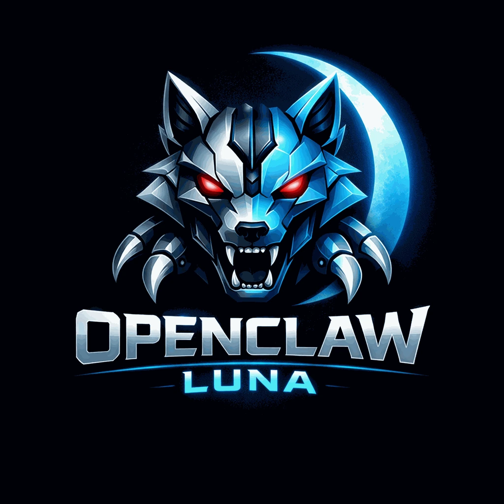

# LunaClaw

<div align="center">

<br />



# LunaClaw

### OpenClaw 的前端与控制中枢（当前仓库提供 VS Code 实现）

**连接 OpenClaw，完成 First Chat，然后再把 Swarm、Preset、导入导出、技能市场和诊断纳入你的主路径。**

[](https://code.visualstudio.com/)
[](https://www.typescriptlang.org/)
[](package.json)
[](LICENSE)

[2 分钟上手](#2-分钟上手) · [工作流能力](#工作流能力) · [当前范围](#当前范围) · [排障](#常见问题--troubleshooting) · [English](docs/README_EN.md)

<br />


<p>
  
  
</p>

</div>

---

## 它是什么

LunaClaw 是 **OpenClaw 工作流的前端与控制面**。本仓库提供的是 **VS Code 实现**。

> 命名说明：产品现在正式叫 **LunaClaw**，同时保留旧名 **OpenClaw Luna** 用于兼容历史文档、命令和生态。

它不是“另一个聊天插件”，而是把 OpenClaw 的多入口体验整理成一条可操作的主路径：

- 先完成 First Chat
- 再进入 Swarm 协作与预设体系
- 最终把导入导出、技能市场、诊断与持久记忆收进一个稳定的控制面

如果你只想要一个轻量聊天框，LunaClaw 并不是目标解法。

---

## 2 分钟上手

### First Chat（最短成功路径）

1. 安装 VS Code 扩展 `LunaClaw`。
2. 打开面板：命令面板 `LunaClaw: Open LunaClaw`，或侧边栏 `OpenClaw`（旧名）。
3. 启动本地 `OpenClaw gateway` 或填写远端 Gateway。
4. 创建第一个 Agent。
5. 发送第一条消息。

First Chat 的标准很简单：能连上、能建 Agent、能收到回复。

### First Swarm（最短协作路径）

1. 进入 Swarm 工作区。
2. 从预设创建或手动添加成员。
3. 选择 Broadcast 或 Collaborate。
4. 运行一次完整协作回合。

### Import / Export（最短迁移路径）

1. 在 Swarm 编辑器里导出当前结构为 JSON。
2. 通过 Import swarm config 恢复一个已导出的 Swarm。
3. 通过 Swarm Preset 快速创建新模板。

---

## 工作流能力

### Agents

- 创建、编辑、删除、刷新 Agent
- 支持 Agent 预设与批量创建
- 支持自定义模型、System Prompt 与工作区

### Swarms

- 在一个工作区里切换 `Broadcast / Collaborate / 成员直连`
- Swarm 成员增删、父子拓扑与协作上下文管理
- 拓扑视图与协作/广播模式切换

### Presets

- Swarm Preset：用于快速搭建协作结构
- Identity Preset：用于成员 profile 的身份模板

### Import / Export

- Swarm 结构导出为 JSON
- Swarm 配置导入恢复

### Skills

- Skill Market（远程 Hub）发现与安装
- 已安装 / 已启用技能的分离视图

### Memory / Persistence

- 目标：持久记忆层（跨机器、跨存储的长期记忆）
- 当前处于规划与实现中

---

## 当前范围

- VS Code 前端：可用
- Swarm Preset / Import / Export：可用
- Skill Market 远程 Hub：可用（持续增强）
- 持久记忆层：进行中
- Onboarding / Doctor：进行中
- Tauri / 桌面端：规划中

---

## 常见问题 / Troubleshooting

- `missing scope: operator.write`：检查 Gateway token 或 auth profile 是否包含 `operator.write`。
- `gateway closed (1000)`：检查 Gateway 进程与端口；确保版本匹配并重启。
- 无法导入 Swarm：确认 JSON 来自导出文件而非 Preset 文件。
- Preset 解析失败：检查 JSON 是否损坏、字段是否缺失。
- Skill Market 不加载：检查网络/代理设置或 Hub 是否可用。
- 本地模型不可用：确认 `models.json` 与 `auth-profiles.json` 路径配置正确。

反馈时请带上：连接模式、失败步骤、原始错误文本。

---

## 连接模式

| 模式 | 适合场景 | 数据来源 |
| --- | --- | --- |
| `Auto Detect` | 自动选择本地最合适的链路 | 本机环境解析 |
| `Gateway` | 远端部署与协作 | OpenClaw Gateway |
| `OpenClaw CLI` | 本地完整 OpenClaw 能力 | 本地 CLI + Gateway |
| `Local Models` | 只跑本地模型 provider | `models.json` / `auth-profiles.json` |

### 配置边界

- `OpenClaw Config` 编辑的是 `openclaw.json`
- `Local Models` 模式使用的是 `models.json` 与可选的 `auth-profiles.json`
- 这两套配置是不同的能力边界

---

## 常用配置

| 配置项 | 说明 | 默认值 |
| --- | --- | --- |
| `openclaw.configMode` | 连接模式 | `openclaw` |
| `openclaw.gatewayUrl` | Gateway 地址 | `http://127.0.0.1:18789` |
| `openclaw.gatewayToken` | Gateway Token | `""` |
| `openclaw.defaultAgent` | 默认 Agent ID | `default` |
| `openclaw.cliPath` | OpenClaw CLI 路径 | `""` |
| `openclaw.nodePath` | Node 路径 | `""` |
| `openclaw.stateDir` | OpenClaw 状态目录 | `""` |
| `openclaw.modelsPath` | Local Models 配置路径 | `""` |
| `openclaw.authProfilesPath` | Auth Profiles 路径 | `""` |

---

## 测试

```bash
npm test
```

当前主路径 smoke 覆盖：

- 扩展激活与主要命令贡献
- `Local Models` 模式下创建 Agent、发送消息、读取 usage
- 切换到 `OpenClaw CLI` 模式后创建 Agent、发送消息、读取 usage
- OpenClaw task 的创建、编辑、启停、立即运行、删除
- OpenClaw config 合并与字段保留
- usage 模型回填与模式切换后的缓存失效

真实 VS Code 宿主链路测试：

```bash
npm run test:host
```

---

## 项目结构

```text
openclaw-vscode-luna/
├── src/
│   ├── commands/
│   ├── extension/
│   ├── managers/
│   ├── panels/
│   ├── providers/
│   ├── services/
│   ├── config/
│   ├── test/
│   └── utils/
├── media/
├── i18n/
├── docs/
├── resources/
└── package.json
```

---

## 贡献

欢迎 issue 和 PR。

```bash
git checkout -b feature/your-change
npm test
git commit -m "Describe your change"
```

---

## License

[MIT](LICENSE) © 2026 OpenClaw
