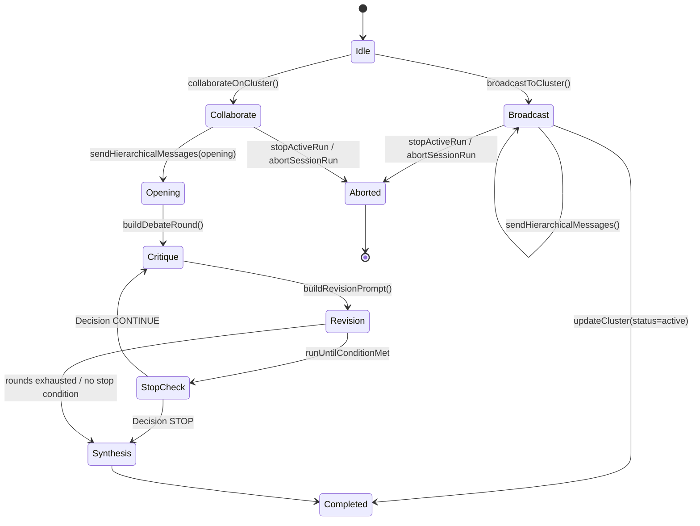

# Agent Swarm 状态机模型（代码核对版）

来源：`src/managers/clusterManager.ts`, `src/panels/openclawPanel/clusterActions.ts`, `src/panels/openclawPanel.ts`

## 关键状态与转移（摘要）
- **Idle**：等待用户触发 swarm（broadcast / collaborate）。
- **Broadcast**：按激活拓扑递归发送（`sendHierarchicalMessages`），完成后进入 Completed。
- **Collaborate**：
  - Opening → Critique → Revision（多轮）
  - 若启用 `runUntilConditionMet`：每轮 Revision 后进入 StopCheck
  - StopCheck 结果 `STOP` → Synthesis → Completed
  - `CONTINUE` → 下一轮 Critique
  - 未启用 stop condition 时：按固定轮次直接进入 Synthesis → Completed
- **Aborted**：UI Stop / abortSessionRun 触发，直接终止当前运行。

## Mermaid

