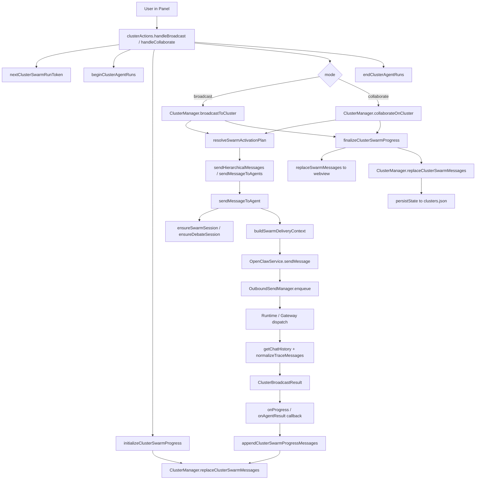
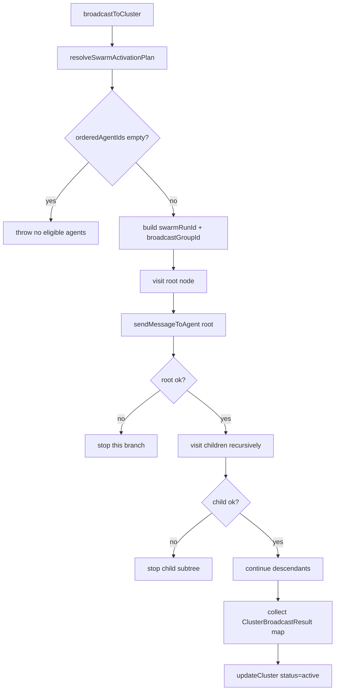
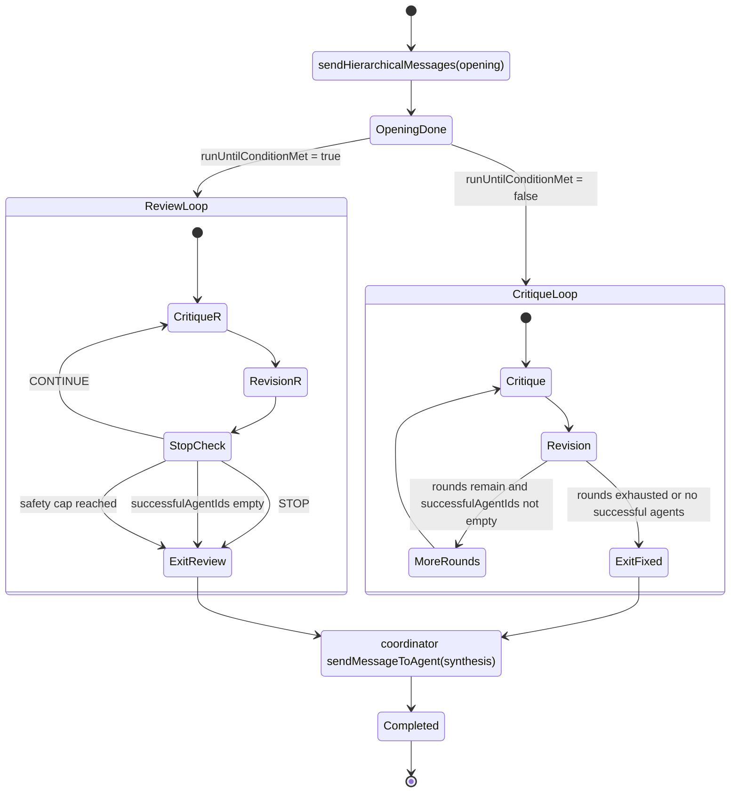
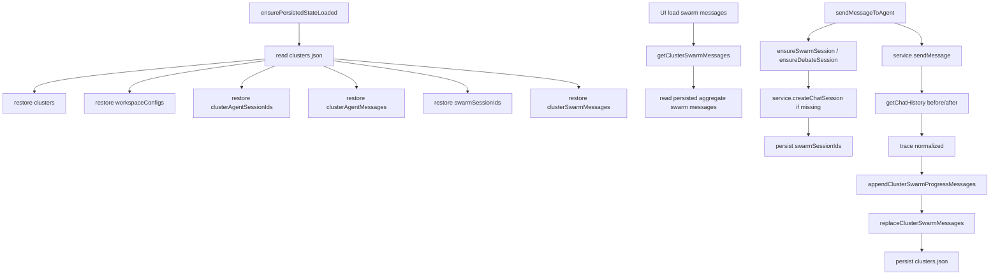
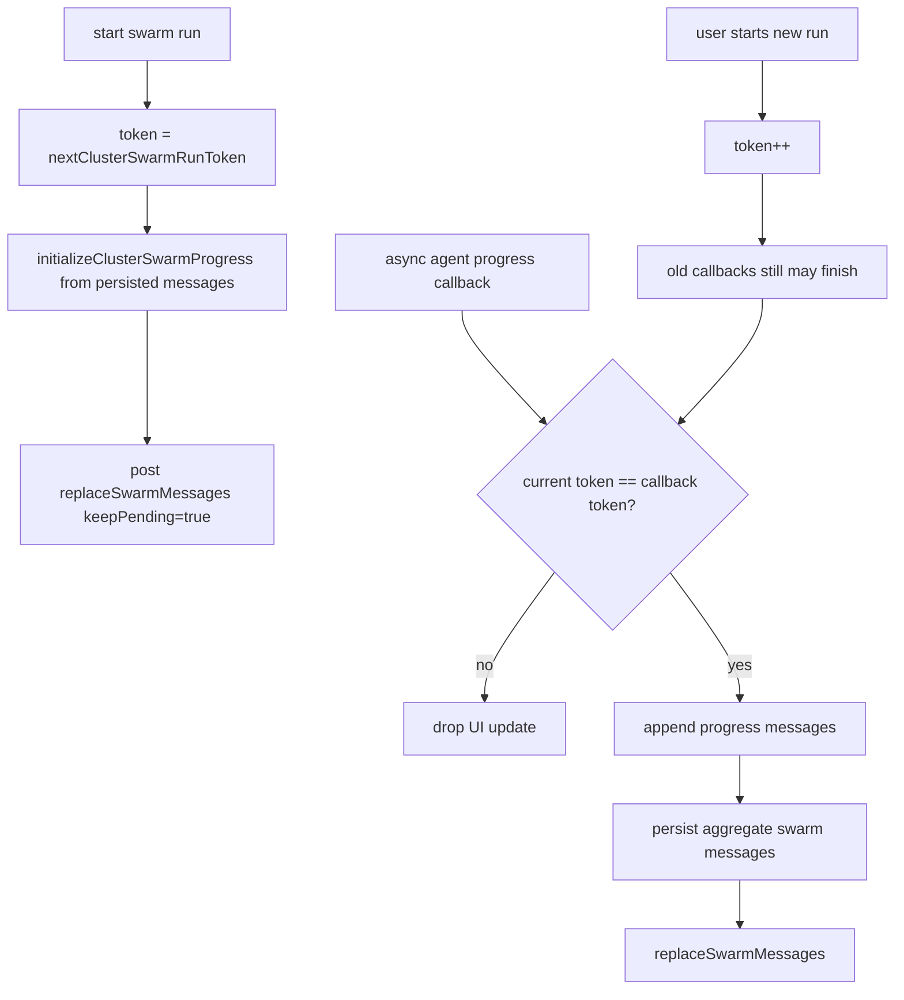

# Agent Swarm Debug Log

来源代码：
- `src/panels/openclawPanel/clusterActions.ts`
- `src/panels/openclawPanel.ts`
- `src/managers/clusterManager.ts`
- `src/services/openclawService.ts`
- `src/services/outbound/outboundSendManager.ts`
- `src/services/openclaw/types.ts`

## 1. 结构分层

- UI 层：`clusterActions.ts`
  - 负责触发 `broadcast` / `collaborate`
  - 负责进度消息拼装、去重、写回 panel
  - 通过 `clusterSwarmRunToken` 防止旧运行覆盖新运行
- 编排层：`ClusterManager`
  - 负责激活计划、分层发送、debate 轮次、stop condition、synthesis
  - 负责 swarm session / cluster session / swarm messages 的持久化
- 传输层：`OpenClawService`
  - 统一把 `sendMessage` 包装进 outbound queue
  - 将 swarm 上下文透传到 runtime / gateway
- 队列层：`OutboundSendManager`
  - 负责 lane 串行、重试、超时、取消、group 元数据记录

## 2. 关键状态对象

- `AgentCluster`
  - 集群定义，含 `agentIds` 与 `workspaceConfig`
- `ClusterWorkspaceConfig`
  - 决定 collaboration style、rounds、coordinator、memberProfiles、stop condition
- `clusterAgentSessionIds`
  - 单 agent 直接对话 session 映射
- `swarmSessionIds`
  - cluster + mode + agent 的 swarm session 映射
- `clusterAgentMessages`
  - 单 agent 面板消息缓存
- `clusterSwarmMessages`
  - swarm 面板消息缓存
- `SwarmDeliveryContext`
  - `swarmRunId / clusterId / mode / round / phase / transactionGroupId ...`

## 3. 总览时序

## 4. Broadcast 逻辑

- `broadcastToCluster` 在 remote cluster 模式下直接走 `service.sendToCluster`
- 本地/工作区模式下会：
  - 读取 cluster
  - 用 `resolveSwarmActivationPlan` 生成激活树
  - 为本次运行生成 `swarmRunId`
  - 为同 phase 生成 `transactionGroupId`
  - 进入 `sendHierarchicalMessages`
- `sendHierarchicalMessages` 的实际行为是：
  - 先跑 root node
  - root 成功才递归 child
  - child prompt 可携带 parent agent、route、parent context
  - 某节点失败时，它的 children 不再下发

## 5. Collaborate 逻辑

- Opening 阶段走 `sendHierarchicalMessages`
- Critique / Revision 阶段走 `sendMessageToAgents`
- `debateSessionIds` 保证同一 agent 在整个协作回合中复用同一 session
- `latestUsableContributions` 只保留每个 agent 最近一次成功结果
- `successfulAgentIds` 每轮都会重新计算
- 如果配置了 `runUntilConditionMet + stopCondition`
  - 每轮 revision 后调用 `evaluateStopCondition`
  - judge 默认优先 coordinator
  - judge 输出必须是 `Decision: STOP|CONTINUE`
- 最终由 coordinator 跑 synthesis

## 6. Session 与持久化

- `ensureClusterAgentSessionId`
  - 给单 agent 上下文页分配稳定 session id
- `ensureSwarmSession`
  - 给 `cluster + mode + agent` 分配稳定 swarm session
  - 首次创建后立刻 `persistState`
- `ensureDebateSession`
  - collaborate 多轮里复用同一个 swarm session
- `replaceClusterSwarmMessages`
  - 写的是 panel 视角的聚合消息，不是 agent 原始 session transcript
- `getClusterAgentSwarmMessages`
  - 直接回读对应 swarm session 的真实 chat history
- `ensurePersistedStateLoaded`
  - 启动时从 `clusters.json` 读回 cluster/workspace/session/message 缓存

## 7. UI 防旧读逻辑

这里已经有一层明确的“新运行覆盖旧运行”保护，但它只保护 webview 更新，不保护底层 agent session 自身的历史。

- `nextClusterSwarmRunToken()` 启动新 run 时递增 token
- `onProgress / onAgentResult` 回调里先比较 token
- token 不匹配时，旧运行结果不会继续刷新 UI
- 但底层 session 仍可能已经写入 runtime history
- 同时 `initializeClusterSwarmProgress` 会把旧的 persisted swarm messages 先读出来，再追加本次 user message

## 8. 与“脏读/旧读”相关的实际机制

从代码看，旧读更可能出在下面几个点：

- 聚合消息是增量追加的
  - `initializeClusterSwarmProgress` 先读旧 `clusterSwarmMessages`
  - 然后追加本次 user message
  - 如果没有显式清理，上一轮聚合上下文会继续作为本轮前缀
- swarm session 是复用的
  - `ensureSwarmSession` 对同一 `cluster + mode + agent` 复用 session
  - collaborate 内又通过 `debateSessionIds` 继续复用
  - 所以 agent 端真实 transcript 是连续累积的，不是每轮新建
- UI token 只阻止“旧回调覆盖新 UI”
  - 不能回滚已经写进 session 的消息
  - 也不能自动裁掉已持久化的旧 `clusterSwarmMessages`
- 持久化是整包覆盖
  - `persistState` 每次把当前 map 全量写回 `clusters.json`
  - 没有版本化 snapshot，也没有 per-run tombstone

## 9. 调试建议

- 先看 `clusterSwarmMessages`
  - 判断 panel 展示的旧内容是来自聚合缓存还是 agent session
- 再看 `swarmSessionIds`
  - 确认是不是复用了同一个 session
- 再看 `swarmRunId / transactionGroupId`
  - 判断一条消息属于哪次 run、哪一轮、哪个 phase
- 如果要彻底隔离每次协作
  - 要么每次 run 创建新的 swarm session
  - 要么聚合缓存按 `swarmRunId` 分桶，而不是按 `clusterId + mode` 覆盖

## 10. 一句话结论

当前 Agent Swarm 不是单纯的“状态机”问题，而是：
- 编排状态按轮次推进
- agent 会话按 cluster/mode 长寿命复用
- panel 聚合消息按 cluster/mode 持久化复用
- UI 仅用 token 避免旧回调覆盖

所以它天然更像“长生命周期会话 + 增量聚合视图”，不是“每次运行完全隔离的事务模型”。
