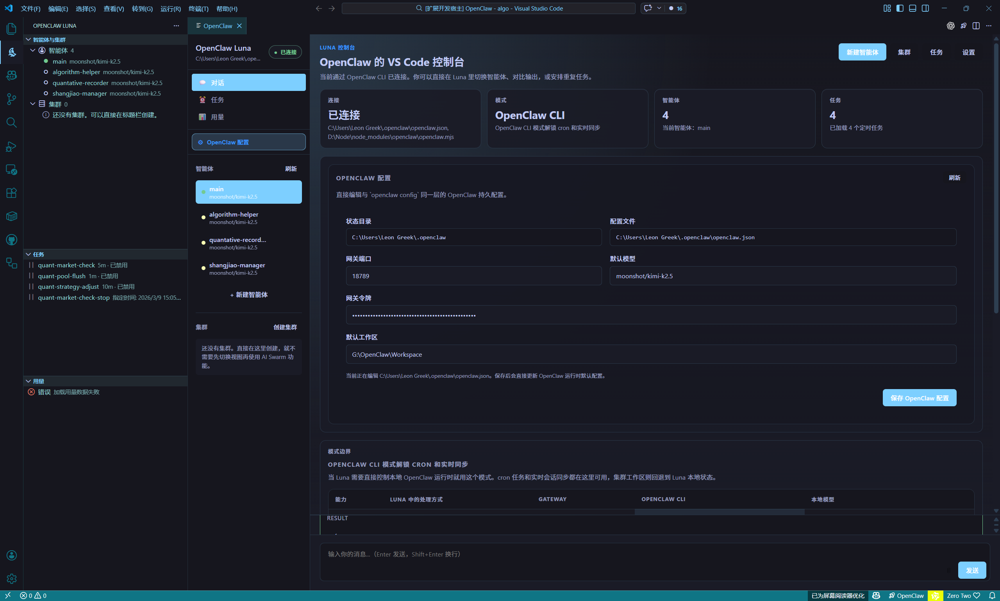
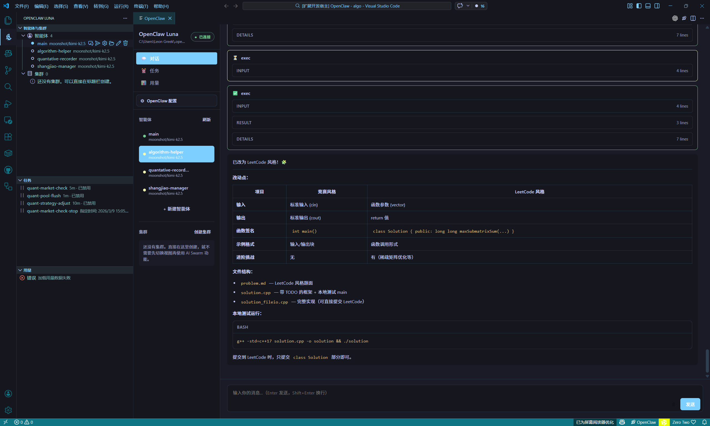
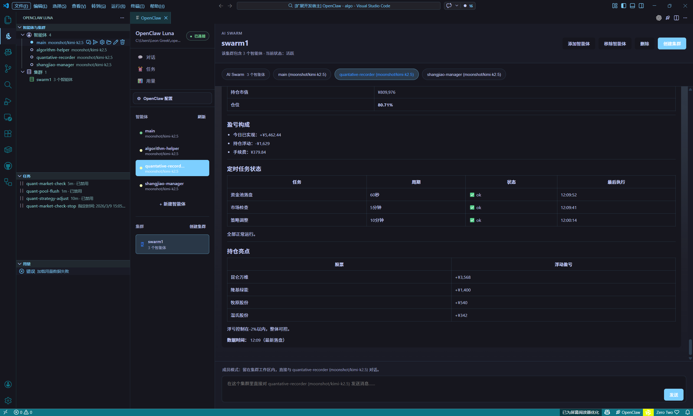

# OpenClaw Luna for VS Code

<div align="center">

<br />


# OpenClaw Luna

### Bring OpenClaw agents, swarms, tasks, and usage back into VS Code

**Connect OpenClaw, create an agent, send the first message, then decide whether you need deeper multi-agent workflows, scheduled tasks, and diagnostics.**

[](https://code.visualstudio.com/)
[](https://www.typescriptlang.org/)
[](../package.json)
[](../LICENSE)

[60-Second Setup](#60-second-setup) · [Core Features](#core-features) · [Connection Modes](#connection-modes) · [Feedback](#if-it-breaks-send-these-three-things) · [中文](../README.md)

<br />



<p>
  
  
</p>

</div>

---

## What It Is

OpenClaw Luna is a VS Code extension that turns OpenClaw into a workflow you can actually operate from one place.

Instead of bouncing between a CLI, config files, browser pages, and scattered commands, Luna gives you one control surface for the common OpenClaw path:

- Connect and verify the first successful run
- Create agents and start chats
- Move into swarms, scheduled tasks, and usage only when you need them

It is best suited for two cases:

- You already use OpenClaw and want your main control path inside VS Code
- You are trying OpenClaw for the first time and want one quick success before learning the full config model

If you want a generic AI chat extension with no OpenClaw workflow attached, that is not what Luna is built for.

---

## 60-Second Setup

### 1. Install the extension

Install `OpenClaw Luna` from the VS Code Marketplace.

### 2. Open the panel

Use any of these entry points:

- Command palette: `OpenClaw Luna: Open OpenClaw Luna`
- Bottom-right status bar item: `OpenClaw`
- Activity Bar sidebar: `OpenClaw`

### 3. Follow the shortest successful path first

Do not optimize every mode on first run. Start with this:

- Check whether OpenClaw is installed locally
- Start the local `OpenClaw gateway`, or enter your remote Gateway
- Keep the default connection mode
- Create your first agent
- Send your first message

### 4. Expand only after the first reply works

Once the first message succeeds, go deeper only if you need it:

- Open `Swarm` for multi-agent collaboration
- Switch to `OpenClaw CLI` for scheduled tasks
- Open `Usage` for requests, tokens, and cost inspection
- Edit `OpenClaw Config` or local model files for tighter control

The first win is simple: connect, create an agent, send a message.

---

## Core Features

### Agent Workspace

- Create, edit, delete, and refresh agents
- Start from built-in agent presets
- Configure custom models, system prompts, and workspaces
- Persist chat history automatically with streaming replies

### Swarm Workspace

- Switch between `Broadcast / Collaborate / Member Chat` inside one workspace
- Open clusters directly from the sidebar
- Add or remove members without leaving VS Code

### Scheduled Tasks

- Read OpenClaw cron jobs and run history
- Support `every / at / cron` schedules
- Create, edit, enable, disable, run now, and delete tasks
- Task support is available in `OpenClaw CLI` mode

### Usage and Diagnostics

- Switch between 7-day and 30-day windows
- Inspect requests, tokens, and cost by day
- Break usage down by model
- Keep operational debugging in the same place as chat and tasks

---

## Why Someone Would Use It

Luna is not solving "how do I add another chat box to VS Code."

It is solving these OpenClaw workflow problems:

- Agent chat lives in one place while cluster management lives somewhere else
- Scheduled tasks push you back into CLI flows
- Usage inspection requires a different surface again
- Different connection modes expose different capabilities, but that difference is easy to hide or misunderstand

If your real workflow already includes agents, swarms, cron, or usage debugging, Luna compresses those paths into one stable surface.

---

## Connection Modes

| Mode | Best for | Data source |
| --- | --- | --- |
| `Auto Detect` | Let Luna choose the best local path automatically | Local environment probing |
| `Gateway` | Shared remote deployment for teams | OpenClaw Gateway |
| `OpenClaw CLI` | Full local OpenClaw workflow, including cron and live session sync | Local CLI + Gateway |
| `Local Models` | Running only against local model providers | `models.json` / `auth-profiles.json` |

### Config Boundaries

- `OpenClaw Config` edits `openclaw.json`
- `Local Models` mode uses `models.json` and optional `auth-profiles.json`
- These are different configuration surfaces, and Luna keeps that capability boundary explicit

---

## When Luna Fits

Good fit:

- You already use OpenClaw
- You want your main control path inside VS Code
- You need agents, swarms, tasks, and usage in the same workflow

Poor fit:

- You only want a lightweight AI chat extension
- You do not plan to use OpenClaw runtime or configuration at all

---

## If It Breaks, Send These Three Things

The most useful bug report is not "it doesn't work." Send these three details instead:

- Which mode you used: `Auto Detect`, `Gateway`, `OpenClaw CLI`, or `Local Models`
- Which step failed: install, connect, create agent, send message, open tasks, or open usage
- The raw error text from the VS Code developer tools, output panel, or in-product message

Feedback links:

- Issues: <https://github.com/LunaticLegacy/openclaw-vscode-luna/issues>
- Repository: <https://github.com/LunaticLegacy/openclaw-vscode-luna>

---

## Common Settings

| Setting | Description | Default |
| --- | --- | --- |
| `openclaw.configMode` | Connection mode | `openclaw` |
| `openclaw.gatewayUrl` | Gateway URL | `http://127.0.0.1:18789` |
| `openclaw.gatewayToken` | Gateway token | `""` |
| `openclaw.defaultAgent` | Default agent ID | `default` |
| `openclaw.cliPath` | OpenClaw CLI path | `""` |
| `openclaw.nodePath` | Node path | `""` |
| `openclaw.stateDir` | OpenClaw state directory | `""` |
| `openclaw.modelsPath` | Local Models config path | `""` |
| `openclaw.authProfilesPath` | Auth Profiles path | `""` |

---

## Tests

```bash
npm test
```

Main-path smoke coverage includes:

- Extension activation and core command contributions
- Creating an agent, sending a message, and reading usage in `Local Models` mode
- Switching to `OpenClaw CLI` mode and creating an agent, sending a message, and reading usage
- Creating, editing, toggling, running, and deleting OpenClaw tasks
- OpenClaw config merge behavior and field preservation
- Usage model fallback and cache invalidation after mode/config changes

For the full VS Code host path:

```bash
npm run test:host
```

---

## Project Structure

```text
openclaw-vscode-luna/
├── src/
│   ├── commands/
│   ├── extension/
│   ├── managers/
│   ├── panels/
│   ├── providers/
│   ├── services/
│   ├── config/
│   ├── test/
│   └── utils/
├── media/
├── i18n/
├── docs/
├── resources/
└── package.json
```

---

## Status

- [x] OpenClaw panel and sidebar entry points
- [x] Agent management and preset-based creation
- [x] Swarm workspace
- [x] OpenClaw cron panel
- [x] OpenClaw Config UI
- [x] 7-day / 30-day usage dashboard
- [x] Main-path smoke tests
- [ ] More real host-path coverage
- [ ] More scenario docs and demo captures

---

## Contributing

Issues and PRs are welcome.

```bash
git checkout -b feature/your-change
npm test
git commit -m "Describe your change"
```

---

## License

[MIT](../LICENSE) © 2026 OpenClaw
